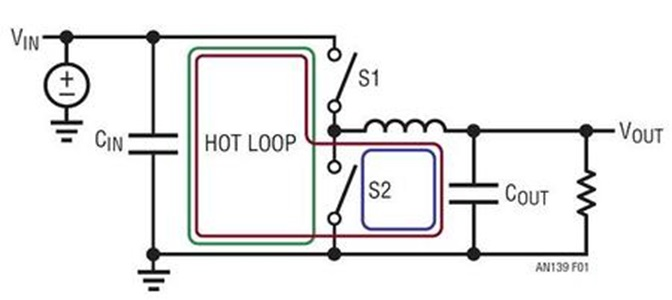
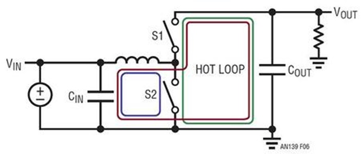
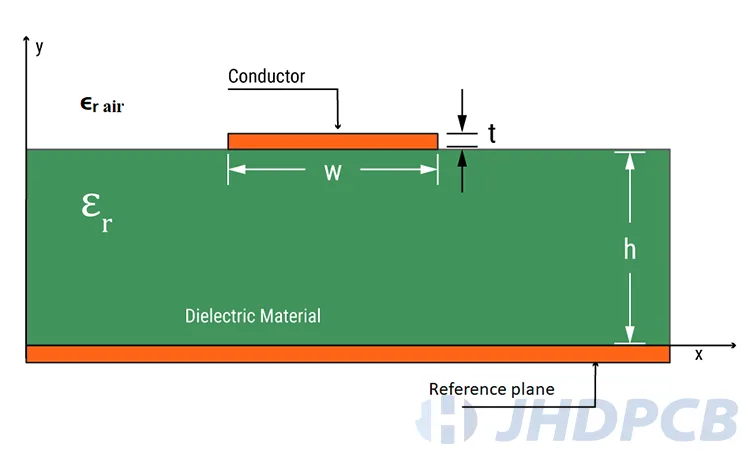
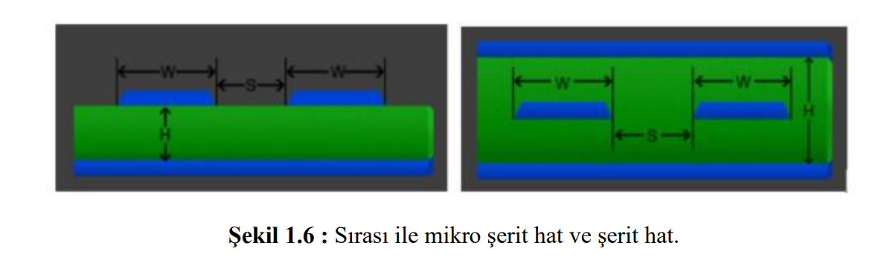
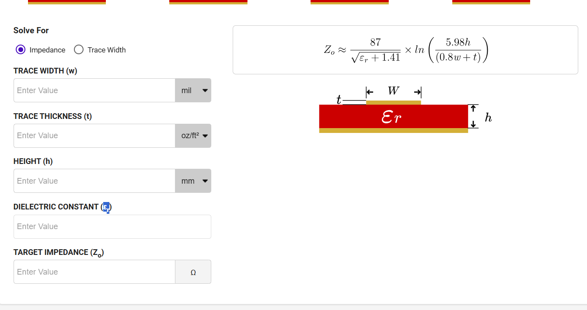

# DONANIM TASARIM NOTLARI

## İleri Seviyeye Donanım Tasarım Notları

Oğuzhan ESEN tarafından hazırlandı.

---
# İçerik tablosu

---
## 1. Giriş
Bu dökümanda donanım tasarlamada önemli noktaların notları ve kaynakları not edilmiştir. Bu yazı sürekli kendini güncellemektedir.

## 2. Anahtarlamalı Regülatör Tasarımlarında Dikkat Edilmesi Gerekeneler

Anahtarlamalı regülatörler yüksek frekansta anahtarlama yaptıkları için PCB tasarımına karşı son derece hassastır. Burda yapılan bir hata pcb kartında gürültüye ve kartın fazla ısınmasına yol açabilir. Ayrıca kullanılan IC'nin kapasitesinin altında çalışmasına sebep olacaktır.

### 2.1 Hot Loop (AC Akım Yolları)
Anahtarlamalı regülatörler, akım akışını iki farklı yol arasında ileri–geri anahtarlar. Bu anahtarlama çok hızlı gerçekleşir ve hızı, anahtarlama kenar sürelerine bağlıdır. Bu nedenle, bir anahtarlama durumunda akım ileten ve diğer anahtarlama durumunda akım iletmeyen izlere “hot loop” veya AC akım yolları denir. PCB yerleşiminde bu yollar özellikle küçük ve kısa tutulmalıdır, böylece izlerin parasitik endüktansı en aza indirilir. Parazitik iz endüktansları istenmeyen bir gerilim sapmasına neden olur ve elektromanyetik girişime (EMI) yol açar.

kısaca;

**Hot loop = anahtarlama anında yüksek dV/dt ve yüksek dI/dt içeren küçük kapalı akım döngüsü.**

**Bu döngü PCB’de EMI’nin ana kaynağıdır ve mümkün olduğunca küçük tutulmalıdır.**

*Hot Loop* topolojiden topolojiye farklılık gösterir.

Buck Converter *Hot Loop*

Boost Converter *Hot Loop*

*Hot loop araştırmasında kullandığım faydalı kaynaklar*
-
- https://www.youtube.com/watch?v=u-y1F_ymImk
- https://www.analog.com/en/resources/technical-articles/layout-for-power-designs-1-hot-loops.html
- https://fscdn.rohm.com/en/products/databook/applinote/ic/power/switching_regulator/swregpcb_layout_essentialchecksheet_an-e.pdf?utm_source=chatgpt.com
- 

### 2.2 İndüktör Yerleşimi

Gerilim dönüştürmek için kullanılan anahtarlamalı regülatörler, enerjiyi geçici olarak depolamak amacıyla indüktör kullanır. Bu indüktörler genellikle oldukça büyük bileşenlerdir ve PCB yerleşiminde doğru bir konuma yerleştirilmeleri gerekir. Aslında bu görev çok zor değildir; çünkü bir indüktörden geçen akım değişebilir fakat aniden değişemez. Akım sadece sürekli ve genellikle nispeten yavaş bir şekilde değişebilir.

İndüktör, hot loop’un dışında yer aldığı için yerleşimi ilk bakışta ikincil önemde görünür. Yine de uyulması gereken bazı kurallar vardır.

- Hiçbir hassas kontrol hattı, bir indüktörün altından geçirilmemelidir; ne PCB’nin üst yüzeyinde, ne iç katmanlarında, ne de alt yüzeyinde. İndüktörden geçen akım nedeniyle bobin güçlü bir manyetik alan oluşturur ve bu alan, sinyal yolundaki zayıf sinyalleri etkileyebilir.

- Anahtarlamalı bir regülatörde kritik sinyal yollarından biri, çıkış voltajını regülatör entegresine veya bir voltaj bölücüsüne taşıyan feedback hattıdır. Bu sebeple FB hatttının Bobinden uzak tutulması gerekmektedir.

İndüktör altındaki ground plane'nin kaldırılıp kaldırılmaması konusu anladığım kadarıyla tartışmalıdır. Bulduğum kaynaklarda eddy current'a karşı kaldırılabilir ama aşağıda yazdığım sebeplerden dolayı bazı tasarımcılar kaldırılmamasının daha uygun olacagını söylemektedir.
- Bir ground plane (toprak katmanı) en iyi şekilde ancak kesintiye uğramadığında koruyucu bir kalkan görevi görür.
- Bir PCB’de ne kadar fazla bakır bulunursa, ısı yayılımı da o kadar iyi olur.
- Eddy akımları oluşsa bile, bu akımlar lokal bölgelerde dolaşır, yalnızca küçük kayıplara neden olur ve ground plane’in işlevini dikkate değer bir şekilde etkilemez. 

### 2.3 *İndüktörün yerleştirilmesinde kullandığım faydalı kaynaklar*

---
- https://www.analog.com/en/resources/analog-dialogue/raqs/raq-issue-164.html?utm_source=chatgpt.com
- https://techweb.rohm.com/product/power-ic/dcdc/3254/?utm_source=chatgpt.com
- https://www.youtube.com/watch?v=6ind9vopKZs&t=34s
- https://www.youtube.com/watch?v=q0oH-nV3dpI

---

## 3. Yüksek Hızlı Hatlarda Sinyal Bütünlüğünün Sağlanması  
### 3.1. Sinyal Bütünlüğü Nedir?

Sinyal bütünlüğü, yüksek hızlı sayısal devrelerde sinyalin performansının
etkilenmeden fonksiyonel gerekleri karşılayacak şekilde korunmasıdır.

Mühendislerin çoğu, yükselme süresi 1 ns veya daha kısa olan sistemleri “yüksek hızlı” olarak sınıflandırır ve sinyal bütünlüğünü özellikle bu tür tasarımlarla ilişkilendirir. yükselme zamanları çok kısa olduğundan sinyal bütünlüğü kritik bir konu haline gelmiştir.

İletim hattının davranışını tanımlayan ana maddeler **karakteristik empedans ve propagasyon gecikmesidir**. Propagasyon gecikmesi sinyalin hattın başından sonuna ulaşma süresini ifade eder. Karakteristik empedans, bir iletim hattının geometrisine ve kullanılan malzemelere göre değişkenlik gösteren ve iletim hattının uzunluğundan bağımsız bir değerdir.

Tek uçlu bir sinyalin karakteristik empedansı, dielektrik materyalin dielektrik katsayısına (Dk), referans düzleme olan uzaklığına (h), yol kalınlığına yani bakır katmanın kalınlığına (t) ve hat genişliğine (w) bağlıdır. Yol genişliği (w) ve dielektrik katsayısının (Er) artması karakteristik empedansı düşürürken, referans düzleme olan uzaklığın (h) artması karakteristik empedansı artırır.

Diferansiyel sinyallerin empedansında ise tek uçlu sinyallerin empedansındaki parametrelerin aynı şekilde etkili olmasının yanında diferansiyel çifti oluşturan yollar arasındaki mesafenin artması (S) diferansiyel karakteristik empedansı artırıcı yönde etki eder.

--- 

 ### 3.2. Sinyal Bütünlüğü ve PCB Tasarım parametreleri

 #### 3.2.1. **PCB malzemesi ve dielektrik sabiti (εr, Dk)**
- Dk yükseldikçe hat kapasitansı artar, karakteristik empedans düşer (aynı empedansı tutmak için hat genişliği daraltılır).

- Dielektrik sabiti, propagasyon gecikmesinin ve karakteristik empedansın
belirlenmesinde önemli bir role sahiptir. Düşük dielektrik sabiti; daha hızlı sinyal iletimi, daha yüksek karakteristik empedans ve daha düşük kaçak kapasitans sağlar.

- 5 GHz’in üzerindeki sinyallerde
dielektrik kayıp baskın hale gelir. Böyle PCBlerde standart FR4 yerine dielektrik sabitin frekansa göre değişkenliği az olan ve aynı zamanda dielektrik kayıp tan(&)’ı  düşük olan daha özel malzemeler kullanılmalıdır.

- Yüksek hızlı sinyallerin hangi katmandan çizileceği de önemli bir konudur. Literatürde yüksek hızlı kritik sinyallerin şerit hat olarak çizilmesi tavsiye edilir. En alt ve üst dış katmanlardan çizilen hatlara mikro şerit (microstrip), ara katmanlardan çizilen hatlara ise şerit hat ( stripline ) denir. Şekil 1.6’da mikro şerit ve şerit hatlarınbir kesiti verilmiştir.

 - Şerit hatlarda E ve H alanlarının çoğu iki düzlem arasında yer aldığından dışarıya veya dışarıdan yayınım sınırlıdır, mikroşeritlerde ise E ve H çizgilerinin bir kısmı dışarıya yayılır . Şerit hatların dezavantajı ise via kullanımı gerektirmesi ve belirli bir empedans seviyesi için daha kalın dielektrik malzeme gerektirmesidir . Vialar empedans süreksizliğine, yansıma ve iletim kayıplarına neden olur. Fakat aynı bakır kalınlığı ve genişliğinde şerit hatlar daha az sinyal zayıflamasına sebep olur.

 #### 3.2.2. **Yüzey pürüzlülüğü (surface roughness) ve deri etkisi (skin effect)**
-  Frekans arttıkça akım yüzeye yaklaşır, iletkenin etkin kesiti küçülür, direnç artar, hat zayıflaması yükselir. 
- Elektrobirikimli (Electrodeposited, ED) bakır kullanmak yüzey pürüzlülüğünü azaltır.

 #### 3.2.3. **Kesintisiz referans düzlemi (GND veya güç plane)**
- Düzlem kesilirse dönüş akımı yol değiştirir, loop alanı büyür, EMI ve indüktans artar, empedans bozulur.
- Kesintisiz düzlem empedansı kararlı tutar, yansımaları azaltır.

 #### 3.2.4. **Hat genişliği (W)**
- Genişlik artarsa kapasitans artar → empedans düşer.
- Genişlik azalırsa kapasitans azalır → empedans yükselir.
(Hedef Z0 için PCB stack-up değiştikçe W yeniden hesaplanır.)

 #### 3.2.5. **Bakır kalınlığı (t)**
- Bakır kalınlığı arttıkça etkin kesit artar → empedans düşer.
- İnce bakırda empedans yükselir, ayrıca AC kayıplar artar.

 #### 3.2.6. **Dielektrik yüksekliği (h)– hat ile referans düzlem arası mesafe** 
- h artarsa kapasitans azalır → empedans yükselir (aynı Z0 için hat genişliği artırılır).
-  h azalırsa empedans düşer.

 #### 3.2.7. **Differansiyel hatların aralığı (S)**
- Aralık daralırsa çiftler arası bağlaşım artar → differansiyel empedans düşer.
- Aralık genişlerse bağlaşım azalır → differansiyel empedans yükselir.
(Gevşek coupled hatlar toleransa daha dayanıklıdır.)

 #### 3.2.9. **Differansiyel hat eşitlemesi (length matching)**
- Fark büyürse sinyaller aynı anda varmaz → skew (Zaman Farkı) artar, jitter (Zamanlama Gürültüsü) oluşur ve protokol bozulur.
→ Uzunluk eşitlemesi bu farkı minimizes eder.

 #### 3.2.10. **Via geometrisi (çap, antipad, yükseklik)**
- Via çapı büyür → kapasitans artar → empedans düşer.
- Antipad büyür → kapasitans azalır → empedans yükselir.
- Via yüksekliği artar → indüktans artar → geçiş kaybı ve yansıma artar.

 #### 3.2.11. **Via kalıntısı (stub)**
- Stub uzadıkça rezonans frekansı düşer, yüksek frekansta büyük kayıp oluşur.
- Back-drill veya microvia ile stub ortadan kaldırılır.

 #### 3.2.12. **Toprak dönüş viaları (GND stitching via)**
- Sinyal via’sına dönüş yolu sağlar.
- Dönüş yolu uzaksa indüktans artar → SI bozulur ve EMI artar.

 #### 3.2.13. **Konnektörler**
- Farklı ortam olduğu için geçiş direnci ve empedans süreksizliği yaratır.
→ Empedanstan sapma → yansıma ve sinyal bozulması.

 #### 3.2.14. **Sonlandırma elemanları (seri/paralel)**
- Seri sonlandırma kaynağa yakın konur, yansımayı ve overshoot’u azaltır.
- Paralel sonlandırma yüke yakın konur, dalga şekli düzgünleşir.

#### 3.2.15. **AC kuplaj kapasitörleri**
- DC’yi keser ama ped geniş olduğu için lokal olarak empedansı düşürür.
- Alt katman boşaltılarak empedans yeniden dengelenir.

https://www.digikey.com/en/resources/conversion-calculators/conversion-calculator-pcb-trace-impedance

https://docs.broadcom.com/doc/12353426

### 3.3.    