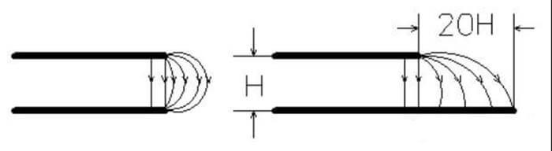
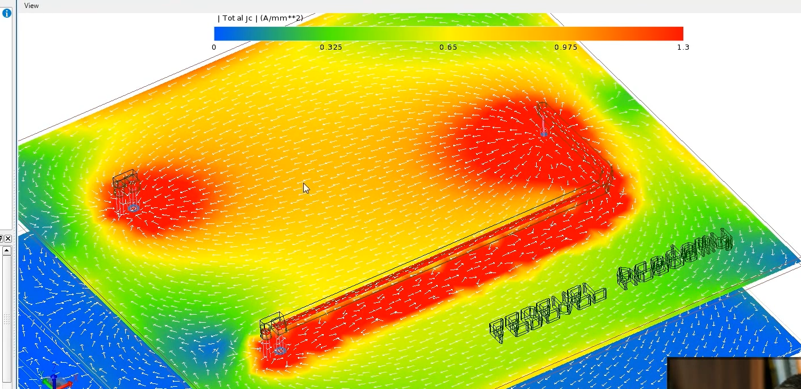
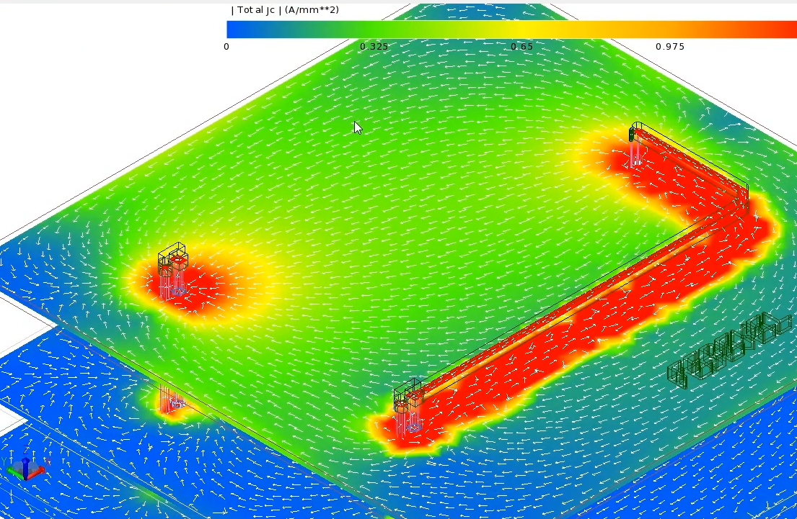
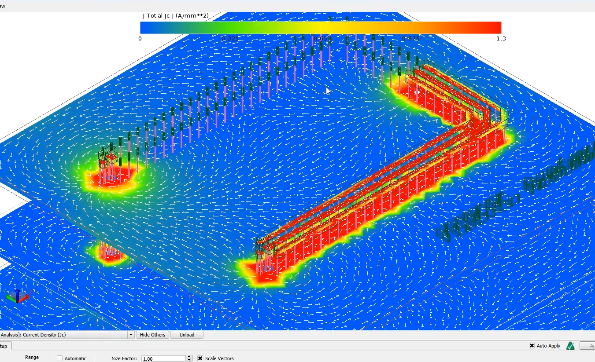

# DONANIM TASARIM NOTLARI

## İleri Seviyeye Donanım Tasarım Notları

Oğuzhan ESEN tarafından hazırlandı.

---
# İçerik tablosu

---
## 1. Giriş
Bu dökümanda donanım tasarlamada önemli noktaların notları ve kaynakları not edilmiştir. Bu yazı sürekli kendini güncellemektedir.

## 2. Anahtarlamalı Regülatör Tasarımlarında Dikkat Edilmesi Gerekeneler

Anahtarlamalı regülatörler yüksek frekansta anahtarlama yaptıkları için PCB tasarımına karşı son derece hassastır. Burda yapılan bir hata pcb kartında gürültüye ve kartın fazla ısınmasına yol açabilir. Ayrıca kullanılan IC'nin kapasitesinin altında çalışmasına sebep olacaktır.

### 2.1 Hot Loop (AC Akım Yolları)
Anahtarlamalı regülatörler, akım akışını iki farklı yol arasında ileri–geri anahtarlar. Bu anahtarlama çok hızlı gerçekleşir ve hızı, anahtarlama kenar sürelerine bağlıdır. Bu nedenle, bir anahtarlama durumunda akım ileten ve diğer anahtarlama durumunda akım iletmeyen izlere “hot loop” veya AC akım yolları denir. PCB yerleşiminde bu yollar özellikle küçük ve kısa tutulmalıdır, böylece izlerin parasitik endüktansı en aza indirilir. Parazitik iz endüktansları istenmeyen bir gerilim sapmasına neden olur ve elektromanyetik girişime (EMI) yol açar.

kısaca;

**Hot loop = anahtarlama anında yüksek dV/dt ve yüksek dI/dt içeren küçük kapalı akım döngüsü.**

**Bu döngü PCB’de EMI’nin ana kaynağıdır ve mümkün olduğunca küçük tutulmalıdır.**

*Hot Loop* topolojiden topolojiye farklılık gösterir.

Buck Converter *Hot Loop*

Boost Converter *Hot Loop*

*Hot loop araştırmasında kullandığım faydalı kaynaklar*
-
- https://www.youtube.com/watch?v=u-y1F_ymImk
- https://www.analog.com/en/resources/technical-articles/layout-for-power-designs-1-hot-loops.html
- https://fscdn.rohm.com/en/products/databook/applinote/ic/power/switching_regulator/swregpcb_layout_essentialchecksheet_an-e.pdf?utm_source=chatgpt.com
- 

### 2.2 İndüktör Yerleşimi

Gerilim dönüştürmek için kullanılan anahtarlamalı regülatörler, enerjiyi geçici olarak depolamak amacıyla indüktör kullanır. Bu indüktörler genellikle oldukça büyük bileşenlerdir ve PCB yerleşiminde doğru bir konuma yerleştirilmeleri gerekir. Aslında bu görev çok zor değildir; çünkü bir indüktörden geçen akım değişebilir fakat aniden değişemez. Akım sadece sürekli ve genellikle nispeten yavaş bir şekilde değişebilir.

İndüktör, hot loop’un dışında yer aldığı için yerleşimi ilk bakışta ikincil önemde görünür. Yine de uyulması gereken bazı kurallar vardır.

- Hiçbir hassas kontrol hattı, bir indüktörün altından geçirilmemelidir; ne PCB’nin üst yüzeyinde, ne iç katmanlarında, ne de alt yüzeyinde. İndüktörden geçen akım nedeniyle bobin güçlü bir manyetik alan oluşturur ve bu alan, sinyal yolundaki zayıf sinyalleri etkileyebilir.

- Anahtarlamalı bir regülatörde kritik sinyal yollarından biri, çıkış voltajını regülatör entegresine veya bir voltaj bölücüsüne taşıyan feedback hattıdır. Bu sebeple FB hatttının Bobinden uzak tutulması gerekmektedir.

İndüktör altındaki ground plane'nin kaldırılıp kaldırılmaması konusu anladığım kadarıyla tartışmalıdır. Bulduğum kaynaklarda eddy current'a karşı kaldırılabilir ama aşağıda yazdığım sebeplerden dolayı bazı tasarımcılar kaldırılmamasının daha uygun olacagını söylemektedir.
- Bir ground plane (toprak katmanı) en iyi şekilde ancak kesintiye uğramadığında koruyucu bir kalkan görevi görür.
- Bir PCB’de ne kadar fazla bakır bulunursa, ısı yayılımı da o kadar iyi olur.
- Eddy akımları oluşsa bile, bu akımlar lokal bölgelerde dolaşır, yalnızca küçük kayıplara neden olur ve ground plane’in işlevini dikkate değer bir şekilde etkilemez. 

### 2.3 *İndüktörün yerleştirilmesinde kullandığım faydalı kaynaklar*

---
- https://www.analog.com/en/resources/analog-dialogue/raqs/raq-issue-164.html?utm_source=chatgpt.com
- https://techweb.rohm.com/product/power-ic/dcdc/3254/?utm_source=chatgpt.com
- https://www.youtube.com/watch?v=6ind9vopKZs&t=34s
- https://www.youtube.com/watch?v=q0oH-nV3dpI

---

## 3. Yüksek Hızlı Hatlarda Sinyal Bütünlüğünün Sağlanması  
### 3.1. Sinyal Bütünlüğü Nedir?

Sinyal bütünlüğü, yüksek hızlı sayısal devrelerde sinyalin performansının
etkilenmeden fonksiyonel gerekleri karşılayacak şekilde korunmasıdır.

Mühendislerin çoğu, yükselme süresi 1 ns veya daha kısa olan sistemleri “yüksek hızlı” olarak sınıflandırır ve sinyal bütünlüğünü özellikle bu tür tasarımlarla ilişkilendirir. yükselme zamanları çok kısa olduğundan sinyal bütünlüğü kritik bir konu haline gelmiştir.

İletim hattının davranışını tanımlayan ana maddeler **karakteristik empedans ve propagasyon gecikmesidir**. Propagasyon gecikmesi sinyalin hattın başından sonuna ulaşma süresini ifade eder. Karakteristik empedans, bir iletim hattının geometrisine ve kullanılan malzemelere göre değişkenlik gösteren ve iletim hattının uzunluğundan bağımsız bir değerdir.

Tek uçlu bir sinyalin karakteristik empedansı, dielektrik materyalin dielektrik katsayısına (Dk), referans düzleme olan uzaklığına (h), yol kalınlığına yani bakır katmanın kalınlığına (t) ve hat genişliğine (w) bağlıdır. Yol genişliği (w) ve dielektrik katsayısının (Er) artması karakteristik empedansı düşürürken, referans düzleme olan uzaklığın (h) artması karakteristik empedansı artırır.

Diferansiyel sinyallerin empedansında ise tek uçlu sinyallerin empedansındaki parametrelerin aynı şekilde etkili olmasının yanında diferansiyel çifti oluşturan yollar arasındaki mesafenin artması (S) diferansiyel karakteristik empedansı artırıcı yönde etki eder.

--- 

 ### 3.2. Sinyal Bütünlüğü ve PCB Tasarım parametreleri

 #### 3.2.1. **PCB malzemesi ve dielektrik sabiti (εr, Dk)**
- Dk yükseldikçe hat kapasitansı artar, karakteristik empedans düşer (aynı empedansı tutmak için hat genişliği daraltılır).

- Dielektrik sabiti, propagasyon gecikmesinin ve karakteristik empedansın
belirlenmesinde önemli bir role sahiptir. Düşük dielektrik sabiti; daha hızlı sinyal iletimi, daha yüksek karakteristik empedans ve daha düşük kaçak kapasitans sağlar.

- 5 GHz’in üzerindeki sinyallerde
dielektrik kayıp baskın hale gelir. Böyle PCBlerde standart FR4 yerine dielektrik sabitin frekansa göre değişkenliği az olan ve aynı zamanda dielektrik kayıp tan(&)’ı  düşük olan daha özel malzemeler kullanılmalıdır.

- Yüksek hızlı sinyallerin hangi katmandan çizileceği de önemli bir konudur. Literatürde yüksek hızlı kritik sinyallerin şerit hat olarak çizilmesi tavsiye edilir. En alt ve üst dış katmanlardan çizilen hatlara mikro şerit (microstrip), ara katmanlardan çizilen hatlara ise şerit hat ( stripline ) denir. Şekil 1.6’da mikro şerit ve şerit hatlarınbir kesiti verilmiştir.

 - Şerit hatlarda E ve H alanlarının çoğu iki düzlem arasında yer aldığından dışarıya veya dışarıdan yayınım sınırlıdır, mikroşeritlerde ise E ve H çizgilerinin bir kısmı dışarıya yayılır . Şerit hatların dezavantajı ise via kullanımı gerektirmesi ve belirli bir empedans seviyesi için daha kalın dielektrik malzeme gerektirmesidir . Vialar empedans süreksizliğine, yansıma ve iletim kayıplarına neden olur. Fakat aynı bakır kalınlığı ve genişliğinde şerit hatlar daha az sinyal zayıflamasına sebep olur.

 #### 3.2.2. **Yüzey pürüzlülüğü (surface roughness) ve deri etkisi (skin effect)**
-  Frekans arttıkça akım yüzeye yaklaşır, iletkenin etkin kesiti küçülür, direnç artar, hat zayıflaması yükselir. 
- Elektrobirikimli (Electrodeposited, ED) bakır kullanmak yüzey pürüzlülüğünü azaltır.

 #### 3.2.3. **Kesintisiz referans düzlemi (GND veya güç plane)**
- Düzlem kesilirse dönüş akımı yol değiştirir, loop alanı büyür, EMI ve indüktans artar, empedans bozulur.
- Kesintisiz düzlem empedansı kararlı tutar, yansımaları azaltır.

 #### 3.2.4. **Hat genişliği (W)**
- Genişlik artarsa kapasitans artar → empedans düşer.
- Genişlik azalırsa kapasitans azalır → empedans yükselir.
(Hedef Z0 için PCB stack-up değiştikçe W yeniden hesaplanır.)

 #### 3.2.5. **Bakır kalınlığı (t)**
- Bakır kalınlığı arttıkça etkin kesit artar → empedans düşer.
- İnce bakırda empedans yükselir, ayrıca AC kayıplar artar.

 #### 3.2.6. **Dielektrik yüksekliği (h)– hat ile referans düzlem arası mesafe** 
- h artarsa kapasitans azalır → empedans yükselir (aynı Z0 için hat genişliği artırılır).
-  h azalırsa empedans düşer.

 #### 3.2.7. **Differansiyel hatların aralığı (S)**
- Aralık daralırsa çiftler arası bağlaşım artar → differansiyel empedans düşer.
- Aralık genişlerse bağlaşım azalır → differansiyel empedans yükselir.
(Gevşek coupled hatlar toleransa daha dayanıklıdır.)

 #### 3.2.9. **Differansiyel hat eşitlemesi (length matching)**
- Fark büyürse sinyaller aynı anda varmaz → skew (Zaman Farkı) artar, jitter (Zamanlama Gürültüsü) oluşur ve protokol bozulur.
→ Uzunluk eşitlemesi bu farkı minimizes eder.

 #### 3.2.10. **Via geometrisi (çap, antipad, yükseklik)**
- Via çapı büyür → kapasitans artar → empedans düşer.
- Antipad büyür → kapasitans azalır → empedans yükselir.
- Via yüksekliği artar → indüktans artar → geçiş kaybı ve yansıma artar.

 #### 3.2.11. **Via kalıntısı (stub)**
- Stub uzadıkça rezonans frekansı düşer, yüksek frekansta büyük kayıp oluşur.
- Back-drill veya microvia ile stub ortadan kaldırılır.

 #### 3.2.12. **Toprak dönüş viaları (GND stitching via)**
- Sinyal via’sına dönüş yolu sağlar.
- Dönüş yolu uzaksa indüktans artar → SI bozulur ve EMI artar.

 #### 3.2.13. **Konnektörler**
- Farklı ortam olduğu için geçiş direnci ve empedans süreksizliği yaratır.
→ Empedanstan sapma → yansıma ve sinyal bozulması.

 #### 3.2.14. **Sonlandırma elemanları (seri/paralel)**
- Seri sonlandırma kaynağa yakın konur, yansımayı ve overshoot’u azaltır.
- Paralel sonlandırma yüke yakın konur, dalga şekli düzgünleşir.

#### 3.2.15. **AC kuplaj kapasitörleri**
- DC’yi keser ama ped geniş olduğu için lokal olarak empedansı düşürür.
- Alt katman boşaltılarak empedans yeniden dengelenir.

https://www.digikey.com/en/resources/conversion-calculators/conversion-calculator-pcb-trace-impedance

https://docs.broadcom.com/doc/12353426

## 4. Dekuplaj (Bypass) Kapasitörü ve Çalışma Mantığı

Dijital entegreler (örneğin mikrodenetleyiciler, FPGA'ler veya yüksek hızlı RF modülleri) durum değiştirdiklerinde, nanosaniyeler içinde güç hattından aniden yüksek bir akım ($di/dt$) talep ederler. Ancak ana güç kaynağı (VRM) ile entegre arasındaki bu anlık enerji transferinde aşılması gereken fiziksel bir engel vardır.

### 4.1. Temel Problem: Parazitik İndüktans ve Voltaj Çökmesi

PCB yollarının fiziksel doğası gereği sahip olduğu **parazitik indüktans ($L$)**, bu ani akım artışına karşı direnç gösterir. İndüktansın akım değişimine gösterdiği bu tepki, entegrenin besleme pinlerinde anlık ve kritik voltaj çökmelerine (voltage droop) neden olur. Bu durum şu temel fizik formülüyle ifade edilir:

$$V = L \cdot \frac{di}{dt}$$

### 4.2. Çözüm: Yerel Enerji Deposu

Bu fiziksel problemi aşmak için **dekuplaj (bypass) kapasitörleri**, entegrenin besleme (VCC) ve toprak (GND) pinlerine mümkün olan en kısa mesafede yerleştirilir. Bu stratejik yerleşimin sisteme sağladığı iki kritik fayda vardır:

* **Anlık Akım Krizini Çözmek:** Kapasitör, entegrenin hemen dibinde "yerel bir enerji deposu" olarak görev yapar. Uzun PCB yollarının indüktansını aradan çıkararak, entegrenin anlık akım talebini voltaj çökmesine fırsat vermeden şimşek hızında karşılar.
* **Güç Bütünlüğünü (Power Integrity) Korumak:** Entegrenin kendi içinde ürettiği yüksek frekanslı anahtarlama gürültüsünü, kartın ana güç hattına sızmasına izin vermeden hemen oracıkta toprağa (GND) aktarır (bypass eder).
[Eric Bogatin decoupling videosu](https://youtu.be/ARwBwHZESOY)

[Eric Bogatin'ın Ferrite bead videosundaki açıklaması](https://www.youtube.com/watch?v=HaLMjVkKYMw)

## 5. Ferrite Bead (Ferit Boncuk) ve Filtreleme Esasları

Ferrite bead, temelde bir indüktör (bobin) olmakla birlikte, içindeki ferit malzemesi sayesinde standart güç indüktörlerinden farklı bir elektriksel karaktere sahiptir. Yüksek akım taşımak için tasarlanan güç indüktörlerinin DC dirençleri (DCR) miliohm seviyelerindeyken, ferrite bead'ler filtreleme amacıyla üretildikleri için tipik olarak yarım ohm ile 1-2 ohm arasında çok daha yüksek bir DC dirence sahiptir.

Güç dağıtım ağlarında (PDN) ferrite bead kullanımının temel amacı, kart üzerindeki anahtarlamalı güç kaynaklarının (VRM) veya diğer yüksek hızlı dijital elemanların güç hattında yarattığı "kirliliği" (gürültüyü), dışarıdan gelen bu kirliliğe karşı çok hassas olan analog donanımlardan (ADC, PLL, DAC vb.) uzak tutmaktır.

 * **Eğer bir switching Regülatör kullanılıyorsa (buck bust converter) güç hatlarında switching Regülatör doğası gereği gürültü oluşur. Filtre kullanmak yerine LDO Regülatörler de kullanılabilir.** 
 * Aslında LC fitre tasarlıyoruz biz.

### 5.1. Tasarımda Dikkat Edilmesi Gereken Kritik Kurallar

* **Sadece Düşük Akımlı Hatlarda Kullanılmalıdır:** Ferrite bead'in sahip olduğu yüksek DC direnç (DCR) nedeniyle, üzerinden yüksek veya değişken (switching) akım geçen hatlarda kullanılması büyük bir DC voltaj düşümüne (IR drop) yol açar. Bu sebeple, yüksek $di/dt$ ile anahtarlama yapan dijital entegrelerin beslemelerinde asla kullanılmamalı; sadece düşük ve sabit akım çeken hassas analog pinlerin (örn. AVCC, VDDA) izolasyonunda tercih edilmelidir.
* **Asla Tek Başına Kullanılmamalıdır:** Güç hattına filtreleme amacıyla sadece bir ferrite bead seri olarak eklenirse, bead'in indüktansı ile entegrenin (veya yolların) parazitik kapasitansı birleşerek bir "LC Tank" devresi oluşturur. Bu durum, gürültüyü engellemek yerine yüksek frekanslı devasa bir çınlamaya (ringing) sebep olarak durumu daha da kötüleştirir.

* **Kasıtlı LC Filtre Tasarımı:** Bu eleman her zaman bir Alçak Geçiren Filtre (Low-Pass Filter) topolojisinin parçası olarak, yani entegre tarafında mutlaka uygun bir kapasitör (C) ile birlikte "LC filtresi" oluşturacak şekilde tasarlanmalıdır.
* **Direnç Karakteristiği Bir Avantajdır:** LC filtrelerinde karşılaşılan en büyük tehlike olan rezonansın (High-Q) sönümlenmesi gerekir. Ferrite bead'in sahip olduğu o yüksek DC direnç, bu noktada bir dezavantaj değil; aksine rezonansı bastıran (damping) ve filtreyi kararlı kılan en önemli özelliktir.

### 5.2. Faydalı Kaynaklar

- [Regülatör tasarımda kullanış olduğum tool webench](https://webench.ti.com/power-designer/switching-regulator/customize/4?noparams=0)

- [ahmet turan hocanın notları](https://www.ahmetturanalgin.com/pcb-yerlesim-ve-duzeni-1)

## 6. PCB Tasarımında Topraklama (Ground), Şase (Chassis) ve EMI Kontrolü

Elektronik tasarımlarda GND (Sinyal Toprağı) ve Şase (Chassis) kavramları birbirine karıştırılabilir, ancak üstlendikleri görevler tamamen farklıdır. Sinyal toprağı devrenin referans noktası ve dönüş yoluyken; şase, güvenliği sağlayan ve dış/iç elektromanyetik gürültüleri (EMI) engelleyen fiziksel bir kalkandır (Faraday Kafesi).

### 6.1. Toprak Düzlemini Bölme (Ground Splitting) Yanılgısı ve Dönüş Yolu

Geçmişte yaygın olan "Analog ve Dijital ground'ları birbirinden ayırın (split)" kuralı, modern ve yüksek frekanslı tasarımlarda büyük EMI sorunlarına yol açan bir hatadır. 

* **Dönüş Yolu Kuralı:** Yüksek hızlı (yüksek frekanslı) sinyallerin dönüş akımları, en kısa mesafeden değil, en düşük empedanslı yoldan; yani gidiş yolunun tam altındaki referans (ground) düzleminden akar.
* **Anten Etkisi (Loop Area):** Eğer toprak düzlemi bölünür (yarık açılır) ve bir sinyal bu yarığın üzerinden geçirilirse, dönüş akımı yarığın etrafından dolanmak zorunda kalır. Bu durum, gidiş ve dönüş yolu arasındaki döngü alanını (loop area) devasa boyutlara ulaştırarak o hattı bir **çerçeve antene (loop antenna)** çevirir. Kart, etrafa EMI saçmaya ve dış gürültüleri toplamaya başlar.
* **Fiziksel Ayırma (Partitioning):** Toprağı bakır seviyesinde bölmek yerine, komponentler gruplandırılmalıdır. Tüm analog devreler kartın bir köşesinde, dijital devreler başka bir köşesinde toplanmalı; ancak altlarındaki toprak düzlemi tek parça ve bütün bırakılmalıdır. 
* **Geçiş Sinyallerini Yavaşlatma:** Dijital bölgeden analog bölgeye mecburen gitmesi gereken kontrol sinyalleri varsa, sınır noktasına bir seri direnç (örn. 1kΩ - 2kΩ) konularak sinyalin kenar geçiş hızları (edge rate) yavaşlatılmalı ve yüksek frekanslı harmonikler törpülenmelidir.

### 6.2. 20H Kuralı (20H Rule) Efsanesi ve Kenar Işıması (Edge Radiation)

Geçmişte EMI'yi engellemek için sıkça tavsiye edilen ancak modern tasarımlarda geçerliliğini yitiren bir PCB tasarım kuralıdır.

* **Kuralın Tanımı:** İç katmanlardaki Güç (Power) düzleminin, Toprak (GND) düzlemine göre dış kenarlardan 20H kadar (H = Sinyal ve GND katmanı arasındaki malzemenin kalınlığı) içeriye çekilmesidir. Amacı, kenarlardan dışarı taşan elektromanyetik alanı (fringing fields) GND düzlemine çarptırıp emilmesini sağlamaktı.
* **Modern Yüksek Frekanslarda Geçersizliği:** EMC testleri, modern yüksek frekanslarda bu çekilme işleminin kenar ışımasını (edge radiation) durdurmadığını, aksine karttaki faydalı alanı daraltarak ve rezonansları değiştirerek EMI'yi daha da kötüleştirebildiğini göstermiştir.
* **Doğru Çözüm (Via Stitching / Çit Yöntemi):** Güç düzlemini içeri çekmek yerine, kartın en dış kenarına çepeçevre bir GND yolu dönülmeli ve bu yol üzerinden iç katmanlardaki GND düzlemlerine sık aralıklarla via'lar atılmalıdır (Picket Fence). Bu metal dikiş ağı, dışarı sızacak dalgalar için kelimenin tam anlamıyla fiziksel bir duvar oluşturur.

### 6.3. Şase Bağlantıları ve Kalkanlama (Shielding)

Metal bir kasa, kendi başına mükemmel bir Faraday kafesidir. Toprağa (Earth Ground) bağlanması sinyalleri kesmesi için değil, elektriksel güvenlik (çarpılmayı önleme) ve statik yüklerin (ESD) deşarjı için gereklidir.

* **360 Derece Kalkan Teması:** Dışarıdan gelen zırhlı/ekranlı kabloların kalkanı, şaseye tek bir ince tel ile (pigtail) bağlanmamalıdır. Yüksek frekanslarda bu ince tel bir indüktöre dönüşerek devasa bir empedans oluşturur (Örn: 300 MHz'de 18 ohm). Kalkan, konnektör yuvası üzerinden şaseye 360 derece (tam çepeçevre) temas etmelidir.
* **GND ve Şase Arasındaki Kapasitif Köprü:** PCB'nin sinyal toprağı (GND), metal şaseden tamamen yalıtılırsa (floating), aralarındaki parazitik kapasitans nedeniyle yüksek frekanslı gürültüler kılıfa atlar. Gidecek yeri olmayan bu enerji, kasanın anten gibi ışıma yapmasına neden olur. 
* **Eşpotansiyel Sağlama:** Bu anten etkisini önlemek için PCB GND ile metal şase arasına bir **Kapasitör** ve ona paralel yüksek değerli bir **Direnç (örn. 1 MΩ)** yerleştirilir. Kapasitör, yüksek frekanslı gürültülerde GND ile kasanın voltaj seviyelerini birbirine eşitleyerek (eşpotansiyel yaratarak) ışıma yapacak voltaj farkını ortadan kaldırır. Direnç ise biriken statik DC yükü yavaşça deşarj eder.

### 6.4. Plastik Kasalarda (Şasesiz) Tasarım ve Diferansiyel Sinyaller

Eğer tasarımda yalıtkan (plastik) bir kasa kullanılıyorsa, Faraday kafesi etkisi kaybolur. Bu durumda dışarıya çıkan veya dışarıdan gelen sinyalleri gürültüden korumak için zırhlı kablo (shield) kullanmanın bir anlamı kalmaz.

* **Gerçek Diferansiyel Sinyalleşme (True Differential Signaling):** Plastik kasa kullanılıyorsa, dış I/O bağlantıları mutlaka diferansiyel olmalıdır (Ethernet, USB, RS485 vb.).
* **Gürültü İptali (Common-Mode Rejection):** Diferansiyel hatlarda bilgi iki zıt sinyal üzerinden taşınır. Dışarıdan gelen elektromanyetik gürültü iki tele de eşit miktarda biner. Alıcı, iki sinyal arasındaki "farka" baktığı için, gürültü matematiksel olarak birbirini sıfırlar.
* **Routing Kuralları:** Diferansiyel sinyallerin görevini yapabilmesi için hatların empedansları kusursuz eşleşmelidir. Bunun için iki yol (trace) birbirine **sıkı kuplajla (yan yana paralel)** gitmeli ve boyları milimetrik olarak **eşit uzunlukta (length matching)** çizilmelidir.

### 6.5. Faydalı Kaynaklar 
* [Ground in PCB Layout - Separate or Not Separate? (with Rick Hartley)](https://youtu.be/vALt6Sd9vlY?list=PLUvQzl37dPP3PGcEEN6f7-6qGlfWPVAvG)

* https://www.ahmetturanalgin.com/toprak-ground-baglantilari 

## 8. Katman Geçişleri ve Stitching (Dikiş) VIA Kullanımı

Yüksek hızlı sinyaller PCB'de katman değiştirdiğinde (örneğin Top'tan Bottom'a), sinyalin tam altından akan dönüş akımının (return current) yolu kesilir. Bu durum fiziksel bir engel yaratır.

### 8.1. Referans Düzlemi Değişimi ve Akımın Dağılması
Sinyal yeni katmana geçtiğinde referans aldığı GND düzlemi de değişir. Eğer bu iki GND katmanını birbirine bağlayan yakın bir köprü yoksa, dönüş akımı bağlantı bulabilmek için geniş bir alana kontrolsüzce yayılır. 
* **Sonuç:** Akımın yayılması döngü alanını (loop area) devasa boyuta çıkararak EMI (anten) ışımasına yol açar ve diğer sinyalleri bozarak sinyal bütünlüğünü (Signal Integrity) zedeler.

**Stitching Via Yokken**

### 8.2. Stitching (Dikiş) VIA'nın Görevi ve Konumu
Sinyalin katman değiştirdiği noktanın hemen yanına atılan GND VIA'larına **Stitching VIA** denir.
* **Görevi:** Dönüş akımına, sinyali kopmadan takip edebilmesi için doğrudan ve düşük empedanslı bir köprü sunar.
* **Konumu:** Sinyal VIA'sına ne kadar yakın olursa akım o kadar derli toplu akar. Uzak olursa akım sapar ve döngü büyür.
* **Çoklu VIA:** Sinyalin etrafına birden fazla dikiş VIA'sı koymak, dönüş akımını mükemmel bir şekilde hapseder.

**Stitching Via varken (1 adet)**

**Stitching Via varken (yol boyunca)**

### 8.3. Ne Zaman Stitching VIA'ya Gerek Yoktur?
Kritik kural şudur: **Sinyal katman değiştirirken referans düzlemi de değişiyor mu?**
Eğer sinyal L1'den L3'e geçiyorsa ve her ikisi de aralarındaki L2'yi referans GND olarak kullanıyorsa, dönüş akımı zaten L2 üzerinde akmaya devam edeceği için Stitching VIA'ya gerek yoktur.

### 8.4. Gerçek Hayatta Tasarımlar Neden "Tesadüfen" Çalışır?
Stitching VIA atılmamış kartların bazen sorunsuz çalışmasının sebebi, PCB üzerindeki dekuplaj kapasitörlerinin GND VIA'larıdır. Dönüş akımları bu VIA'ları tesadüfi bir köprü olarak kullanır. Ancak yüksek hızlı ve kritik sinyallerde iş şansa bırakılamaz; dönüş yolu mühendis tarafından kontrollü bir şekilde çizilmelidir.

### 8.5. Faydalı Kaynaklar
* [How GND VIAs Improve Your PCB Layout - Robert Feranec](https://youtu.be/nPx2iqmVAHY) - Katman değişimlerinde dönüş akımlarının Keysight ADS ile görselleştirilmiş EMI simülasyonları.

 